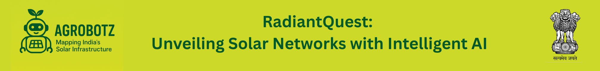

# Mr Sunshine India - Mapping India's Solar Infrastructure


|  |  |
|--|--|
| **Submission to:** | MIT Global AI Hackathon 2025 |
| **Track 01:** | Agentic AI for Dataset Building |
| **Challenge 02:** | "Solar Detective: Mapping India's Solar Infrastructure Using Agentic AI" |
| **Team:** | **GrindelwaldAI** | 
| | *Kevin Riehl, ETH Zürich* |
| | *Shaimaa El-Baklish, ETH Zürich* | 

## Demos On YouTube

<table>
    <tr>
        <td> <b>Product Demo</b> </td>
        <td> <b>Technical Stack</b> </td>
    </tr>
    <tr>
        <td> <a href="https://www.youtube.com/watch?v=x7Je689GEHo">  </a> </td>
        <td> <a href="https://www.youtube.com/watch?v=mrsucS0p7GE">  </a> </td>
    </tr>
</table>


## Description
India’s solar revolution is surging forward, yet the data on commercial solar projects remains fragmented across government, companies and operators websites. *Mr Sunshine India* addresses this gap with an AI-powered agentic scraping pipeline that automates the discovery, extraction, and organization of publicly available solar infrastructure data across the country.

This project is more than a map. It’s a living, intelligent dashboard that turns disorganized information into a national asset. At its heart are three dynamic panes:

- **Project Overview** shows the full picture of India’s commercial solar installations—where they are, who built them, and how they shape the renewable grid. This creates urgently needed transparency over all running solar projects in India.
- **Investment Navigator** empowers developers and investors with instant ROI assessments, helping identify high-potential regions and underutilized markets and make better-informed decisions. 
- **Tender Navigator** surfaces active government tenders (e.g. from SECI), making it easier than ever to discover new business opportunities and plan bids strategically. This fosters the Indian solar ecosystem even further.

By uniting these capabilities, *Mr Sunshine India* creates a single source of truth for a diverse range of stakeholders: policymakers can spot regional disparities, investors can act on real-time intelligence, and developers can find and seize new tenders with confidence.

A powerful future capability lies in turning this dashboard into a real-time intelligence engine. With automated agents regularly scraping public data sources and feeding them into a PostgreSQL database, the app can stay up-to-date with new projects, investment opportunities, and tenders—ensuring that stakeholders always have access to the freshest, most relevant insights.

## How to run the app

Prepare your Python Environment
```
pip install -r requirements.txt
```

Run as Streamlit Application (Python-based Front-End in Browser)
```
cd ./src/ui
streamlit run app.py
```


## Data Sources For Scraping

All data sources were scraped during the competition on May 01st 2025.
- **Governmental Pages**
  - [Tenders by Indian Government](https://www.seci.co.in/view/publish/tender?tender=all)
  - [MNRE.GOV.IN](https://mnre.gov.in/en/annual-report/)
  - [SECI.CO.IN](https://www.seci.co.in/business/solar-photovoltaic)
  - [NSEFI.IN](https://www.nsefi.in/)

- **Company Projects**
  - [Grid Companies](https://report.grid-india.in/index.php?p=Weekly+Report%2FPSP+Report)
  - [Azure Power](https://www.azurepower.com/project-overview?view_all=on&field_project_category_target_id%5B9%5D=9&field_project_category_target_id%5B10%5D=10&field_project_category_target_id%5B11%5D=11&field_project_locations_target_id%5B1%5D=1&field_project_locations_target_id%5B2%5D=2&field_project_locations_target_id%5B15%5D=15&field_project_locations_target_id%5B14%5D=14&field_project_locations_target_id%5B12%5D=12&field_project_locations_target_id%5B3%5D=3&field_project_locations_target_id%5B4%5D=4&field_project_locations_target_id%5B13%5D=13&field_project_locations_target_id%5B5%5D=5&field_project_locations_target_id%5B6%5D=6&field_project_locations_target_id%5B7%5D=7&field_project_locations_target_id%5B8%5D=8)
  - [RENEW.COM](https://www.renew.com/global-presence)
  - [RENEW](https://investor.renew.com/financials/annual-reports)
  - [Tata Energy](https://www.tatapower.com/renewables/solar-energy#tabs-9975c704ed-item-2a3f25ad7e-tab)